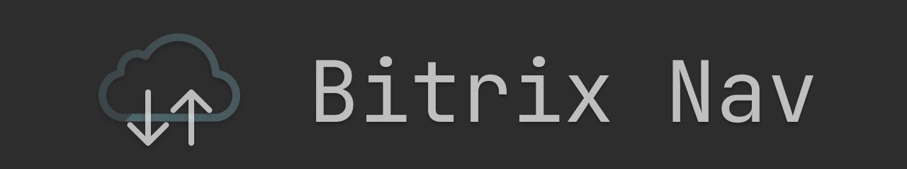

# Bitrix Nav

Keyboard shortcuts for navigating Bitrix24 chats faster.



## Features

- Open a command bar to search recent chats
- Navigate to the next or previous chat in the recent list
- Focus the message textarea with a shortcut
- Uses the Bitrix recent chat sidebar as the source of truth
- Preserves chat order as shown in the Bitrix UI
- Supports cached recent chats through extension storage

## Shortcuts

- `Ctrl/Cmd + K`: Open/close command bar
- `Ctrl/Cmd + ]`: Go to next chat
- `Ctrl/Cmd + [`: Go to previous chat
- `Ctrl/Cmd + Shift + L`: Focus message input
- `Esc`: Close command bar

## Development

Install dependencies:

```bash
pnpm install
```

Run in Chrome:
```bash
pnpm wxt -b chrome
```

Run in Firefox:
```bash
pnpm wxt -b firefox
```

## Build

Build for Chrome:
```bash
pnpm wxt build -b chrome
```

Build for Firefox:
```bash
pnpm wxt build -b firefox
```

Create distributable ZIPs:
```bash
pnpm wxt zip -b chrome --mv3
pnpm wxt zip -b firefox --mv3
```

## Notes

- Chat data is read from the recent chat sidebar
- No external backend is required


## Supported Pages

- `https://*.bitrix24.com.br/online*`

## Privacy

[PRIVACY](PRIVACY.md)

## License

MIT
